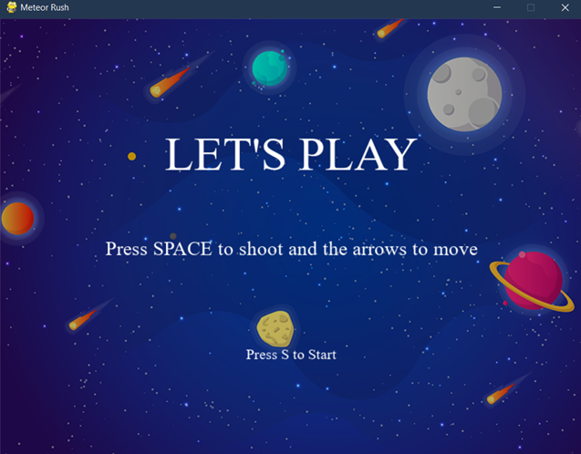
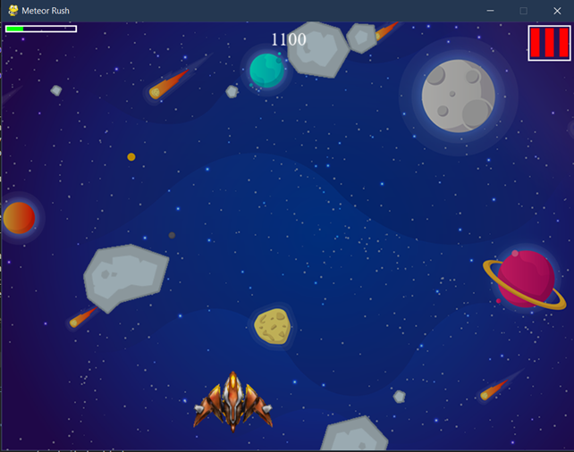
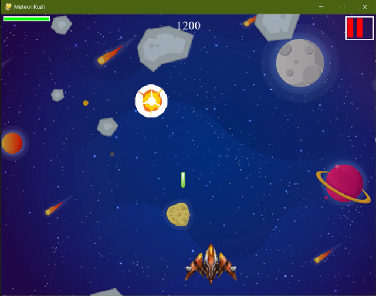

## How to play

- Use the arrows to move
- Use SPACE to shoot. You can only have three bullets on the screen at the same time.
- Avoid meteors
- If you get hit four times by meteors, you lose

To execute the game go inside the directory where the game is found and write:
```python
python .\main.py
```
## screnshots :




